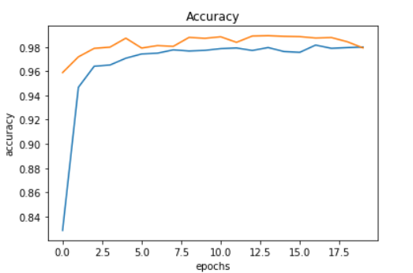
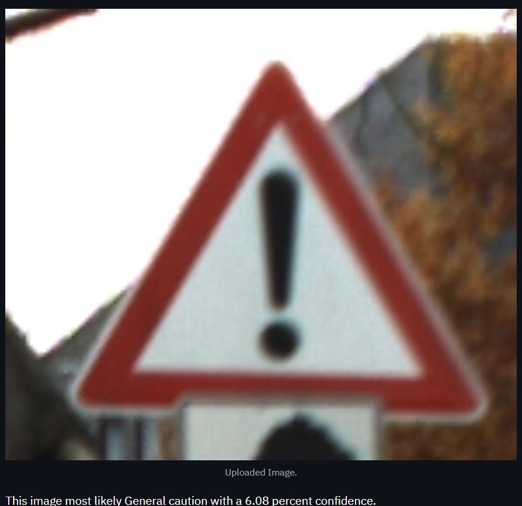

# Traffic Sign Classification
* Create a model that reliably classifies traffic signs with convoluational neural network withtest set accuracy of 97.92%
* The dataset used for this project is German Traffic Signs. There are 43 unique traffic signs in the dataset and a quick look at the histogram of the number of samples for each traffic sign shows that they are unevenly distributed. Each image in the dataset is 32 pixels x 32 pixels x 3 Channels (one each for RGB).
* Dataset : https://www.kaggle.com/meowmeowmeowmeowmeow/gtsrb-german-traffic-sign

## streamlit app traffic_sign_classification

